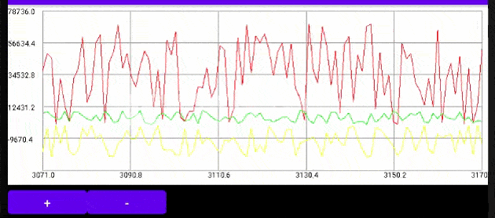

Small Chart for drawing line graphs

  

Add to markup file XML

```
<com.zuga74.minilinechart.MiniLineChart   
  android: id = "@ + id / MiniLineChart"   
  android: layout_width = "match_parent"
  android: layout_height = "200dp" />
```


In code:
```
Chart = findViewById (R.id.MiniLineChart);
//create series
MiniLineChartSeries Series1 = new MiniLineChartSeries (Color.RED);
MiniLineChartSeries Series2 = new MiniLineChartSeries (Color.GREEN);
//add series to Chart
Chart.AddSeries (Series1);
Chart.AddSeries (Series2);
//add points in the series
Series1.AddPoint (1.0, 18.0);
Series2.AddPoint (1.0, 36.0);
Series1.AddPoint (2.0, 72.0);
Series2.AddPoint (2.0, 144.0);
//and call drawing
Chart.invalidate ();
```

----------------- RUS ------------------------

Небольшой Chart для рисования графиков

  

Добавить в файл разметки XML

```
<com.zuga74.minilinechart.MiniLineChart
  android:id="@+id/MiniLineChart"
  android:layout_width="match_parent"
  android:layout_height="200dp" />
```


В коде

```
Chart = findViewById(R.id.MiniLineChart);
//создать серии
MiniLineChartSeries Series1 = new MiniLineChartSeries(Color.RED);
MiniLineChartSeries Series2 = new MiniLineChartSeries(Color.GREEN);
//Добавить серии в Chart
Chart.AddSeries(Series1);
Chart.AddSeries(Series2);
//добавляем точки в серии 
Series1.AddPoint(1.0, 18.0);
Series2.AddPoint(1.0, 36.0);
Series1.AddPoint(2.0, 72.0);
Series2.AddPoint(2.0, 144.0);
//и вызваем прорисовку
Chart.invalidate();
```


